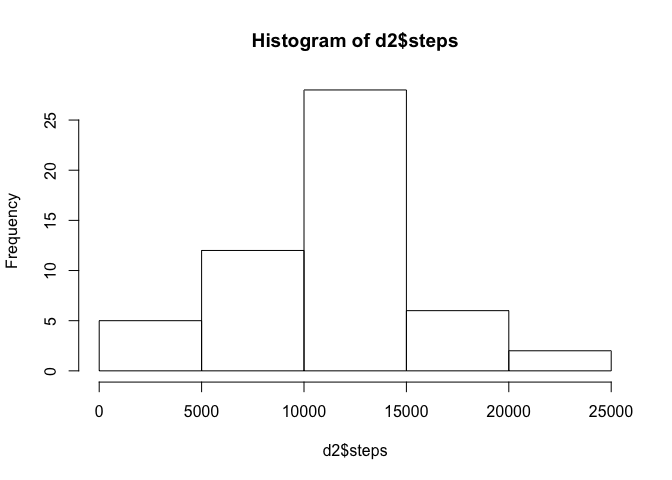
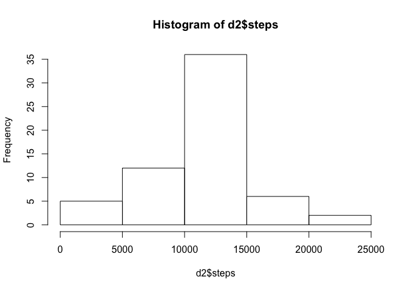
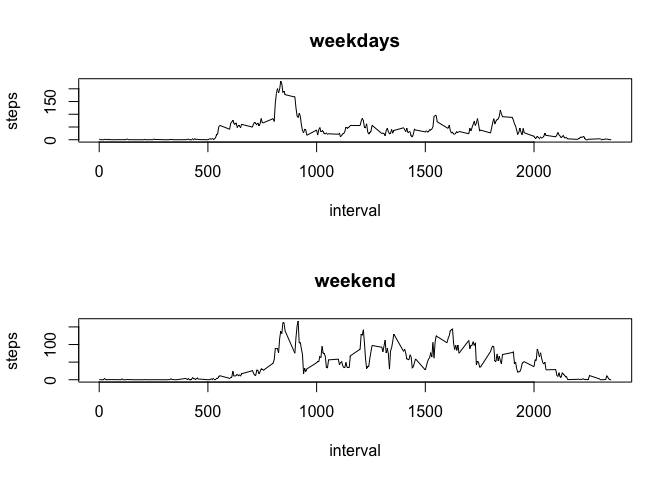

## Loading and preprocessing the data

### Load the data

### Process/transform the data (if necessary) into a format suitable for your analysis


```r
d0<-read.csv("activity.csv",header=TRUE,na.strings ="NA")
d1<-na.omit(d0)
```


## What is mean total number of steps taken per day?

### Calculate the total number of steps taken per day


```r
d2<-aggregate(steps~date,data=d1,sum)
```

### Make a histogram of the total number of steps taken each day


```r
hist(d2$steps)
```

<!-- -->

### Calculate and report the mean and median of the total number of steps taken per day


```r
mean(d2$steps)
```

```
## [1] 10766.19
```

```r
median(d2$steps)
```

```
## [1] 10765
```

## What is the average daily activity pattern?

### Make a time series plot of the 5-minute interval (x-axis) and the average number of steps taken, averaged across all days (y-axis)


```r
d3<-aggregate(steps~interval,data=d1,mean)
plot(d3,type="l")
```

<!-- -->

### Which 5-minute interval, on average across all the days in the dataset, contains the maximum number of steps?


```r
d3$interval[d3$steps==max(d3$steps)]
```

```
## [1] 835
```


## Imputing missing values

### Calculate and report the total number of missing values in the dataset


```r
sum(is.na(d0))
```

```
## [1] 2304
```

### Devise a strategy for filling in all of the missing values in the dataset.

### Create a new dataset that is equal to the original dataset but with the missing data filled in.


```r
d4<-d0
d4$steps[which(is.na(d4))]<-d3$steps[match(d4$interval[is.na(d4)],d3$interval)]
```

### Make a histogram of the total number of steps taken each day


```r
d2<-aggregate(steps~date,data=d4,sum)
hist(d2$steps)
```

<!-- -->

### Calculate and report the mean and median total number of steps taken per day. 


```r
mean(d2$steps)
```

```
## [1] 10766.19
```

```r
median(d2$steps)
```

```
## [1] 10766.19
```

## Are there differences in activity patterns between weekdays and weekends?

### Create a new factor variable in the dataset with two levels - "weekday" and "weekend" indicating whether a given date is a weekday or weekend day.


```r
w<-as.factor(weekdays(as.Date(d4$date, format = "%Y-%m-%d")) == "Saturday" | weekdays(as.Date(d4$date, format = "%Y-%m-%d")) == "Sunday")
d4<-cbind(d4,w)
```

### Make a panel plot containing a time series plot of the 5-minute interval (x-axis) and the average number of steps taken, averaged across all weekday days or weekend days (y-axis)


```r
d5<-aggregate(steps~interval+w,data=d4,mean)
d6<-d5[d5$w==FALSE,]
d7<-d5[d5$w==TRUE,]
par(mfrow=c(2,1))
plot(steps~interval,d6,type="l",main="weekdays")
plot(steps~interval,d7,type="l",main="weekend")
```

<!-- -->
